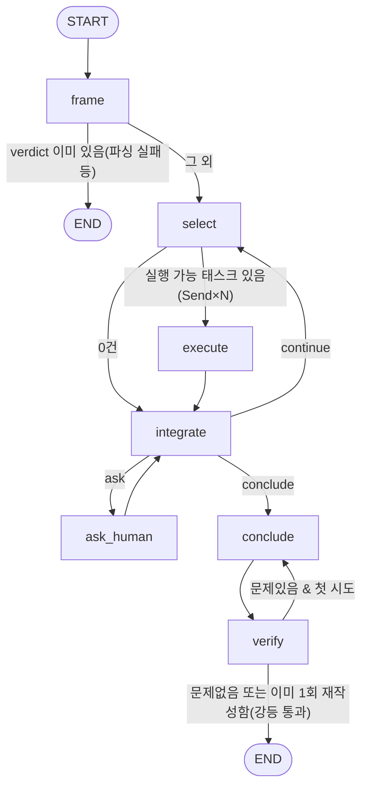

# 아키텍처

이 문서는 시스템이 실제로 어떻게 배선돼 있는지를 코드 기준으로 설명한다.
설계 근거(왜 이렇게 결정했는지)는
[docs/superpowers/specs/2026-09-02-ops-monitoring-design.md](superpowers/specs/2026-09-02-ops-monitoring-design.md)에
있다 — 이 문서는 "지금 코드가 어떻게 동작하는가"에 집중한다.

## 1. 4계층

```
presentation  →  application  →  domain  ←  infrastructure
```

의존은 항상 안쪽(domain)을 향한다. domain은 다른 계층을 import하지 않는다.

- **domain** (`src/domain/`) — 순수 모델과 포트(ABC)만 있다. `Case`, `Verdict`,
  `EvidenceRef`, `Envelope`/`ProbeResult`, `EngineEvent`, `CaseRecord`,
  `Finding`/`CheckOutcome`, 그리고 대상 시스템에 접근하는 포트
  (`RedisReaderPort`/`MongoReaderPort`/`KafkaInspectorPort`/`RestProberPort`/`CodeRepoReaderPort`)와
  케이스 저장소 포트(`CaseRepositoryPort`, `CaseStorePort`)가 여기 있다.
  모든 모델은 `StrictModel`(`extra="forbid"`)을 상속한다.

  포트 표면은 `get`/`query`/`fetch_spec` 셋뿐이다. `fetch_spec()`에 **인자가
  없는 것**도 같은 계열의 설계다 — 경로가 인자면 호출자가 정하게 되어 "임의의
  경로를 GET하라"가 다시 표현 가능해진다. 어느 경로로 나갈지는 어댑터가
  `target.rest.openapi_path`를 보고 정한다.

  **`RestProberPort`에 쓰기 메서드가 없는 것은
  실수가 아니라 설계다** — v1은 `get` 하나뿐이라 쓰기가 물리적으로 불가능했고,
  POST가 필요해진 뒤에는 등재제가 그 자리를 대신한다: `query(entry, params)`가
  받는 것은 경로가 아니라 **등재 항목 이름**이고, 메서드는 어댑터가
  `target.rest.entries`의 선언을 보고 고른다. body는 항목의 닫힌 스키마를
  통과해야 소켓에 나간다(CLAUDE.md 규율 9).
- **application** (`src/application/`) — 조사 엔진 자체. 그래프 배선
  (`graph.py`), 노드 로직(`nodes.py`), State(`state.py`), 서브에이전트 실행
  (`subagents.py`), 접수(`intake.py`), 케이스 큐·워커(`worker.py`), 종결 처리
  (`close.py`), 브리핑 조립(`briefing.py`), 이벤트 매핑(`events.py`)이 있다.
- **infrastructure** (`src/infrastructure/`) — domain 포트의 실제 구현체.
  `Real*`(실제 Redis/Mongo/Kafka/REST 클라이언트)와 `Stub*`(인메모리 대역)가
  같은 포트를 구현하며, `factory.py`의 `build_adapters`가 `SiteConfig.target.adapters`
  값("stub"|"real")만 보고 어느 쪽을 조립할지 결정한다 — 이게 스텁↔실구현
  전환의 유일한 지점이다. 그 외 체크포인터(LangGraph용, `checkpointer.py`),
  Mongo 케이스 저장소(`mongo_store.py`), LLM 팩토리(`llm.py`)도 여기 있다.
- **knowledge** (`src/knowledge/`) — 사람이 쓰고 git에 커밋하는 산출물의 로더.
  `topology/`(어떤 서비스가 무엇을 쓰는가), `deployment/`(지금 어떤 커밋이
  배포돼 있는가), `target_api/`(대상 API의 pinned OpenAPI). 셋 다 content
  digest가 케이스에 박제돼, 나중에 판정을 다시 읽을 때 "그때 무엇을 보고
  있었나"를 알 수 있다.

  **`config/`와 `knowledge/`의 차이가 이 시스템의 신뢰 구조다**: config는
  권한(무엇을 불러도 되는가)이고 knowledge는 증거(대상이 어떻게 생겼다고
  말하는가)다. pinned OpenAPI는 우리가 손으로 쓴 등재 항목이 실제 API와
  어긋나면 기동을 거부하지만, **반대로 우리 허용 범위를 넓히지는 못한다** —
  대상이 새 POST를 배포했을 때 우리가 자동으로 따라가면 fail-open이다
  (CLAUDE.md 규율 9).
- **presentation** (`src/presentation/`) — 케이스 종결 후 산출물. 보고서
  렌더링(`report.py` 마크다운, `report_html.py` HTML)과 2단계(pending→sent)
  메일 발송(`mail.py`).
- **api** (`src/api/`) — 세 프로세스(`api`/`worker`/`patrol`) 중 `api`의 진입점
  (스펙 §3.1). presentation 아래가 아닌 이유는 **별도 프로세스**이기 때문이다.
  **`api`는 실행자가 아니라 클라이언트다** — 케이스를 쓰고 이벤트를 읽을 뿐,
  조사를 시작하지 않고 대상 시스템에 붙지 않는다. `tests/api/test_boundary.py`가
  import 그래프로 그것을 지킨다: `src/api/` 아래 어느 파일이 어댑터 팩토리나
  워커를 import하면 실패한다. 산문 규율은 읽지 않으면 무력하다.
- **CLI**(`src/__main__.py`)는 presentation 바깥의 진입점으로 취급한다 — 여기서만
  `datetime.now()`를 직접 부르는 것이 허용된다(아래 "시계 주입" 참고).

## 2. 두 모드의 실제 실행 경로

### 모드 ①: 사람이 문제 제기 (`chat`)

```
CLI(chat) → resolve_scope()  ── 미확정이면 후보를 보여주고 끝(케이스 없음)
          → access.can_access()  ── 접수 경계의 접근 검사(`case resume`에도 같은 검사가 있다)
          → open_case()  ── **케이스가 먼저 열린다**(origin="human")
          → intake_turn() 반복 ── 되물을 때마다 awaiting_human으로 파킹
          → InvestigationWorker.run_once(interaction_policy="interactive")
          → (awaiting_human이면 stdin으로 답을 받아 answer_case 반복)
          → closed → 보고서 경로 출력
```

**케이스가 접수보다 먼저 열린다**(계획 12). CLI에서는 차이가 안 보이지만, HTTP에서는
첫 요청이 돌려줄 `case_id`가 있어야 하고 접수 문답이 프로세스 사망을 견디려면
담을 케이스가 있어야 한다. 그래서 조립이 함수 넷으로 쪼개져 있고, 계획 13의 API가
**같은 함수들**을 붙인다 — `_run_chat`이 조립을 독점하면 API가 그것을 베끼게 되고,
케이스 종결 세 경로가 발행 배선에서 겪은 일이 반복된다(규율 8).

- `resolve_scope`(`src/application/scope.py`) — `--gbm/--fct`를 안 주면 registry의
  활성 사이트를 후보로 해석한다. **후보는 코드가 만들고 LLM은 그 안에서만 고른다**:
  이 축은 어느 법인의 Redis/Mongo와 소스 저장소를 읽을지를 정하므로 자유 서술로 두면
  증상 텍스트가 다른 법인의 조사를 여는 통로가 된다. 미확정이면 케이스를 만들지
  않고 후보를 돌려준다 — 스코프 없는 케이스는 어떤 어댑터로 무엇을 조사할지도,
  누가 볼 수 있는지도 정해지지 않아 뜻이 없다.
- `open_case`(`src/application/open_case.py`) — 확정된 스코프와 **원문 증상**만으로
  연다. `target_locator`는 아직 비어 있고 접수가 채운다. 사람이 처음 쓴 문장은
  `human:symptom` 증거로 박제된다.
- `intake_turn`(`src/application/intake.py`) — 한 번에 LLM 한 번. 더 물어야 하면
  `awaiting_human` + `question_kind="intake"`로 파킹한다. **답은 이어가기 전에 먼저**
  `human:intake_answer` 증거로 박제된다 — 미루면 그 사이 프로세스가 죽었을 때
  사람의 답이 사라진다.
- `answer_case`(`src/application/answer.py`) — `question_kind`를 보고 접수를 이어갈지
  그래프를 재개할지 가른다. 접수 질문에 그래프 재개를 걸면 아직 없는 스레드를
  재개하려다 실패하고, 그 실패가 F3 복구 경로를 타 사람 눈에는 "답했는데 조사가
  깨졌다"로 보인다.

접수 턴 상한은 `engine.max_intake_turns`가 정하고 코드가 강제한다(규율 6) — 넘으면
대상 없이 조사에 들어간다.

### 모드 ②: 에이전트 자체 순찰 (`patrol run`)

```
PatrolDaemon(스케줄러) → 주기마다 run_check() → CheckOutcome
   ok       → 레저에만 기록
   error    → 레저에 error로 기록(연속 self_check_errors회 넘으면 자기 감시가 잡음)
   finding  → admit_finding()(게이트)
                 opened   → CaseQueue에 적재 → InvestigationWorker가 lease를 잡고 조사
                 attached → 기존 열린 케이스에 증거로 첨부(새 케이스 안 엶)
                 rejected → 억제(스크래치 케이스만 갱신, 케이스 안 엶)
```

`src/patrol/daemon.py`의 `PatrolDaemon`이 스케줄링(`scheduler.py`,
APScheduler)부터 큐·워커·정리(retention sweep)까지 한 프로세스로 조립한다.
점검 하나(`CheckConfig`)는 `resolve_probe()`로 프로브를 고르고
(`src/patrol/probes.py` — `rest_get`/`rest_query`/`redis_get`/`mongo_recent`/
`kafka_lag` 5종, `target`의 kind 접두사로 기본 선택되거나 `probe` 필드로 명시),
그 결과를 `judge`(`"rule"`|`"llm"`|`"rule+llm"`)로 판정한다. rule 판정은
`src/patrol/rules.py`의 6종이다 — `range`/`exists`/`freshness`/`max`에
`all_zero`/`expected_state`가 더해졌다.

점검마다 `concern`(`system`|`operation`)이 붙고, 그 값이 finding→케이스→보고서
헤더→**메일 수신자**와 리드 브리핑의 방향까지 따라간다. 배관이 새는 것과 현장이
이상한 것은 받을 사람도 볼 곳도 다르기 때문이다. 값은 **사람이 config에 적는다** —
응답 모양으로 추론하면 "왜 이 메일이 나한테 왔나"에 답할 수 없다(규율 6).
**rule에서도 유도하지 않는다**: `max`를 불량 수에 걸면 기존 rule로 쓴 현장
이상이고, `all_zero`를 큐 깊이에 걸면 새 rule로 쓴 파이프라인 신호다.

`rest_query`(등재 항목 호출, POST 포함)만 프로브 앞에 **해석 단계**가 하나 더
붙는다(`src/patrol/resolvers.py`):

```
check.resolve ──▶ resolve_params()
                   │  from: "rest"|"mongo"|"redis" → 살아 있는 소스에서 값을 읽는다
                   │  from: "clock"                → app.timezone 기준 날짜
                   │  from: "unfiltered"           → 그 키를 일부러 생략(증거에 기록)
                   ▼
                 전부-또는-전무 ── 하나라도 못 내면 params를 비우고 호출 자체를 안 한다
                   │              (빈 필터 요청은 0/0/0인지 전체 조회인지 구별 불가)
                   ▼
                 {정적 params.body} + {해석된 값} ──▶ 어댑터가 등재 스키마로 **재검증**
                                                      ──▶ 소켓
```

값을 config에 적으면 즉시 썩기 때문이다(사업부/법인마다 다르고 매일 바뀐다).
config는 값이 **어디서 오는지**만 선언한다. 잘라낸 표본·필드 없는 행은
`Envelope.complete=False` + `truncated_reason`으로 증거까지 따라간다.

게이트(`src/patrol/gate.py`)는 같은 지문(`fingerprint(gbm, fct, check, target)`)의
열린 케이스가 있으면 새로 열지 않고 기존 케이스에 증거로 붙인다 — 중복 케이스
억제. 최초 finding은 스크래치 케이스(`patrol:{gbm}:{fct}:{check}`)에 스냅샷으로
먼저 박제된 뒤 판정에 따라 정식 케이스로 승격되거나 버려진다.

어느 경로든 케이스가 조사에 들어가면 **같은 조사 엔진**(§3)을 탄다. 유일한
차이는 `interaction_policy`다: `chat`은 `"interactive"`(질문이 생기면 사람에게
직접 묻는다), 순찰이 연 케이스는 기본 `"autonomous"`(질문이 생기면
`engine.autonomous_question_policy`에 따라 보수적 기본값으로 답하고 로그만
남기거나 — `"default_and_log"` — 사람에게 파킹한다 — `"park"`).

### 모드 ③: HTTP로 문제 제기 (`api` + `patrol run`)

```
클라이언트 → POST /cases ─→ submit_case()  ── chat과 같은 함수: 스코프→접근→개설→첫 접수 턴
                              (되물을 게 있으면 202 응답에 질문이 실린다)
           → POST /cases/{id}/intake-answers ─→ intake_turn()   ── 응답에 다음 질문 또는 완료
           → (intake_done=True인 open 케이스를) 워커(patrol run)의 requeue가 집어 조사
           → GET /cases/{id}/events?since=N  ── 저장된 이벤트 로그 (SSE도 같은 로그의 폴링)
           → 그래프가 파킹하면 awaiting_human + question
           → POST /cases/{id}/answers {answer, key} ─→ submit_answer() ── **기록만** (202)
           → 워커의 requeue가 pending_answer를 집어 answer_case() ── 실행은 여기서
           → GET /cases/{id}/report
           → POST /cases/{id}/label ─→ submit_label()  ── 실제 원인 되먹임(append-only)
           → GET /cases/{id}  ── CaseDetail: 판정 + candidates(rank 1 = root_cause) + timeline
```

## Fleet 집계(P7 — 계획 16)

집계는 **케이스가 아니다.** `Case`에 밀어넣으면 requeue가 집계 레코드마다 LLM 그래프를
돌리고, `Verdict`가 전부 "조사 실패" 낙인을 찍고, `symptom`/`t0`/`fingerprint`에 정직한
값이 없어 발명해야 하며, 사이트 없는 지문이 실제 finding과 충돌한다. 그래서 별도 1급
개념이다.

- **선언**(`config/scenarios/{name}.json`, `src/config/schema_scenario.py`) — 사이트 층이
  아니라 자기 파일에서 **단독 검증**된다. 사이트 층에 두면 사이트마다 잡이 등록돼 같은
  집계가 N번 돌고 메일도 N통 간다. 사이트는 켜고 끄는 것만 말한다(`patrol.scenarios`).
- **팬아웃**(`src/fleet/run.py`) — `max_parallel_sites`가 **사이트를 가로지르는** 전역
  세마포어다. 기존 `guards.max_concurrent`는 사이트당 하나라 30 사이트면 120 in-flight가
  조사 트래픽과 함께 나간다(규율 6: 상한은 코드가 쥔다).
- **수집**(`src/fleet/collect.py`) — 기존 프로브를 그대로 쓴다. `MetricSpec`이 프로브가
  읽는 계약(target·probe·params·sample·resolve)을 그대로 만족한다(규율 9: 새 포트 없음).
  사이트 하나의 실패는 그 사이트의 커버리지 항목이지 집계의 죽음이 아니다.
- **감축**(`src/fleet/reduce.py`) — `sum`/`avg`/`max`/`min`/`count`/`count_nonzero` 6종
  Literal뿐이다. 범용 DSL은 감사 불가능하다. 빈 표본은 **0이 아니라 None**이다.
- **정직성**(`src/domain/rollup.py`) — 위 glossary의 validator들. 리포트는 커버리지를
  숫자보다 먼저 렌더한다. 선택 지표(`required: false`)의 누락은 커버리지에서 빠진다 —
  안 그러면 미배포 지표 하나가 사이트 전체를 미확인으로 낙인찍는다.
- **관측** — 집계는 `EngineEvent`를 내지 않는다(규율 7 — 엔진 산출물이 아니다). 레저의
  `fleet:<이름>` 행과 `DigestStorePort`의 실행 기록이 관측 지점이고, 후자가 추세 비교의
  유일한 재료다(`GET /digests/{scenario}`).

### Mongo 질의를 config로 표현하기

`MongoReaderPort.find`는 처음부터 `filter`를 받았지만 순찰 경로에는 `mongo_recent`
(항상 `filter={}`)뿐이라 "특정 컬렉션에 특정 질의"를 config로 쓸 수 없었다. `mongo_find`
프로브가 그 자리를 연다 — `probe: "mongo_find"`로 **명시할 때만** 쓰이므로 기존 점검은
그대로다.

읽기 전용은 여기서도 메커니즘이다(규율 9): 필터 연산자는 닫힌 허용 목록을 통과해야 하고
(`filter_problems` — 어댑터·스텁·기동 검증이 **같은 함수**를 쓴다), `$where`처럼 서버측
JS를 도는 연산자는 표현할 수 없다. 값은 `resolve`로 해석해 필터에 합친다(리스트는 `$in`)
— config에 값을 적으면 즉시 썩고, 해석기가 하나라도 못 내면 질의 자체를 안 한다
(전부-또는-전무: 빈 필터로 전체를 긁으면 "거짓 안심"이 되고 그건 조용해서 더 위험하다).
정적 필터와 `resolve`의 키가 겹치면 기동에서 거부한다.

**표면을 좁게 유지한 대가**: 해석기 값은 동등 비교(`$eq`) 또는 `$in`으로만 합쳐지므로
시간 범위 질의(`{"ts": {"$gte": <어제>}}`)를 config로 쓸 수 없다. `clock` 해석기는 값
하나를 내고 정적 필터가 그 값을 참조할 문법이 없다 — 참조 문법을 만들면 그것이 곧
표현식 DSL이고, 규율 6이 금지한 것이다. 필요해지면 그때 좁은 형태로 연다.

### 답이 어느 질문의 답인가(계획 17)

답 채널과 접수는 같은 레코드를 두 경로가 쓰는 자리이고, 둘 다 읽기와 쓰기 사이가
원자적이 아니었다.

- **질문 대조(If-Match)** — 클라이언트가 본 질문 번호(`question_seq`)를 실어 보내면
  저장소가 **답을 싣는 그 한 동작 안에서** 대조하고, 다르면 `stale_question`이다.
  Mongo는 CAS 술어에도 번호를 건다 — 사전검사만 두면 읽고 나서 파킹이 일어난 경우를
  못 막는다. `GET /cases/{id}`가 번호를 내고 `case show`가 `#N`으로 보인다.
  번호를 안 보내면 예전 동작이다(하위 호환).
- **접수 저장의 CAS** — `intake._save`가 **턴이 시작할 때 읽은** 값을 술어로 걸어
  조건부로 쓴다(`update_if`). 재읽기 값으로 걸면 창이 좁아질 뿐 닫히지 않는다: 두 턴이
  각자 읽고 각자 LLM을 돌린 뒤 각자 재읽고 쓰면 둘 다 이긴다. 술어는 시각 하나가 아니라
  **접수가 소유한 필드 전부**(status·question·question_kind·question_seq·intake_done·
  target_locator)다 — 고정 시계에서는 이긴 턴이 쓴 시각이 진 턴이 읽은 값과 같아 둘 다
  이기고, 같은 문구로 다시 묻는 두 턴은 시각도 문구도 안 바뀐다. 되묻기(`_park`)도 같은
  술어를 탄다. **술어의 직렬화는 `save`와 같아야 한다**(`to_jsonable_python`) — 한쪽이
  `.isoformat()`을 쓰면 Mongo에서 CAS가 영원히 지고 인메모리 테스트에는 안 보인다.
- **대조의 자리** — 조사 질문은 `resume_once`가 lease를 잡은 뒤, 접수 질문은 `intake_turn`이
  레코드를 읽은 직후(그 값이 곧 CAS 술어다). CLI·`chat`·HTTP 세 경로가 모두 번호를 흘린다.

## 학습 루프(P8 — 계획 15)

두 기록이 짝이다: `VerdictSnapshot`(기계가 뭐라 했나)과 `RootCauseLabel`(실제로 뭐였나).
어느 쪽도 나중에 복구할 수 없다 — retention이 90일에 `Verdict`·증거·case_file을 지우고,
라벨은 사람이 그때 안 주면 영영 없다. 그래서 종결 시점에 남기는 것이 전부다.

- **`Ticker`(`src/application/lifecycle.py`)** — 경과 시간의 소스. `Clock`과 다른 양이고
  (`datetime.now()` 금지의 목적은 *기록 시점*의 감사, 경과는 재현 불가능한 것이 정상),
  CLI 경계에서 `time.perf_counter`로 주입한다. 워커가 엔진 구간을 재서 케이스 파일·
  `VerdictSnapshot.duration_s`·`MetricsSinkPort`에 남긴다(실패 종결 포함 — 빼면 분모에
  생존 편향). 안 잰 것(토큰)은 **0이 아니라 "미측정"**으로 보고서 푸터에 적는다.
- **`MetricsSinkPort`(`src/patrol/ledger.py`)** — `LedgerPort` 3분할의 마지막 조각.
  점검 이력·발송과 달리 **버려도 되는 관측치**라, 호출부가 실패를 삼켜도 되는 유일한
  레저다(관측성이 조사를 죽이면 안 된다). retention은 `ledger_d`로 같이 걷는다.
- **이력 tier 검색(`src/application/history.py`)** — 벡터 없이 결정론 사다리로 과거
  종결 케이스를 찾는다: ①같은 지문 ②같은 대상·같은 사이트 ③같은 대상·다른 사이트
  ④상류 대상. 낮은 tier로 한 번만, K=3, `degraded`·요약 없는 케이스 제외(워커 실패의
  잔해는 순수 잡음). 판정 재료는 Store가 아니라 스냅샷에서 읽는다(retention이 Store를
  비운다). **렌더된 줄 전체에서 evidence id를 지운다** — 과거 id를 리드가 인용하면
  `verify`의 인용 우주(`state.evidence`)에 이번 케이스의 같은 id가 실재해 그대로
  통과한다. 조회가 실패하면 브리핑이 그 사실을 말한다("없음"과 다른 말이다).
  이력은 `Case.history`로 State에 실려 흐른다 — 엔진은 사이트당 한 번 조립돼 캐시되므로
  `EngineDeps`의 정적 필드로는 케이스마다 바꿀 수 없다.
- **브리핑 재료(`src/application/briefing.py`)** — 스펙 §3.6은 다섯을 열거하지만
  **넷만 실재한다**: 토폴로지 슬라이스, 적용 룰, 유사 이력, 배포 버전. **자유 문서는
  없다** — 코퍼스 로더도 선별기도 만들지 않았고, 매번 "없음"을 찍는 자리를 남겨 두면
  다음 사람이 "배선돼 있겠지"로 읽는다(이 리포가 `resume_once`와 `patrol run`의
  `scenarios`로 두 번 데인 착각이다). 적용 룰과 배포는 `EngineDeps`에 **텍스트가 아니라
  구조로** 실린다 — 무엇이 이 케이스에 관련 있는지는 슬라이스를 아는 `frame`이 정한다.
  관련성은 코드가 쥔다(규율 6): 점검은 표적이 슬라이스 locator일 때, 배포는 서비스가
  슬라이스 안일 때만 실린다. **`[...]` 섹션 어휘를 쓰는 프롬프트는 전부 개행을
  접는다**(`one_line` — 브리핑·접수·사이트 선택·리드의 integrate/conclude·서브에이전트 도구 반환) — 한 줄이 쪼개지면 그 조각이 다음 섹션 머리말처럼 보이고,
  위조된 `[적용 룰]`이 진짜보다 먼저 온다. 고정 문자열과 `Literal`·`datetime` 필드는
  값 자체가 개행을 못 담아 지나지 않는다. 여러 줄이 정상인 내용(증거 본문·순찰 스냅샷)은 `repr()`을 거쳐
  들어와 개행이 이미 이스케이프돼 있다 — 그 안전이 우연이 아니라 계약임을 테스트가
  못박는다. 가장 강한 벡터는 `[증상]`이다
  (`Finding.summary`가 그대로 들어오고, `judge="llm"` 점검에서 그것은 LLM이 쓴 자유
  문자열이다). 배포는 **"없음"을 절대 안 쓴다** — 매핑 자체가 없으면
  "이 사이트의 코드 증거는 미검증", 슬라이스 서비스가 매핑에 빠져 있으면 **그 이름을 대고**
  미검증이라 적고, 슬라이스가 비었으면 "대상 서비스 없음"이다. 부재는 "배포가 없다"가
  아니라 "무엇이 도는지 모른다"이고, 코드 증거가 그 사실을 달아야 한다. 세 상태를 안
  가르면 "없음"이 그 셋을 뭉개고, 사람이 연 케이스는 `target_locator`가 없어 항상 셋째에
  걸린다. 조립은 `assemble_sites` 한 곳이라 그것을 부르는 네 명령(`patrol run`·`chat`·`case resume`·`scenario`)이 함께 얻는다.
- **`RootCauseLabel`·`case label`·`POST /cases/{id}/label`** — append-only, 케이스당 복수.
  `agreement` 4분류가 component 문자열 비교보다 믿을 만하다(자유 문자열은 절대 일치하지
  않고, 자동 비교는 우리 정규화기를 측정한다). 보고서 푸터가 라벨 명령을 안내하고 이미
  달린 라벨을 보인다 — 세 발행 경로 전부.
- **캘리브레이션 게이트와 그 소비자(`src/application/labels.py`)** — 종결 케이스의 라벨
  30건 **그리고** 종결의 절반 초과 전에는 어떤 정확도도 계산하지 않는다. 임계는 코드가
  쥔다(config로 빼면 게이트가 협상 대상이 된다). 열리면 `calibration`이 `confidence`별
  적중을 내고 `case label --stats`가 찍는다 — 상관계수가 아니다(대상이 범주형이라
  Pearson r은 범주 오류). **분모 규칙도 코드가 쥔다**(규율 6 — 어느 라벨을 셀지 사람이
  고르면 숫자가 원하는 대로 나온다): `unknown` 라벨은 분모에서 빼되 **뺀 수를 같은 줄에**
  보고하고(조용히 빼면 n이 작은 이유를 모른다), 케이스당 **마지막 라벨만** 세고(append-only라
  여럿 붙는다 — 전부 세면 여러 번 고친 케이스가 분모를 지배한다), `confidence`가 없는
  스냅샷은 버리지 않고 `"미상"` 버킷에 넣는다(confidence를 못 낸 판정이 곧 어려운 케이스라,
  버리면 분모에 생존 편향이 생긴다). `saw_report`(보고서를 보고 단 라벨) 수도 적중률 **옆에**
  둔다 — 따로 두면 사람이 적중률만 읽는다.
- **조사 지표의 소비자(`patrol status`)** — `MetricsSinkPort`에 쌓인 `investigation.duration_s`를
  요약한다. 이 포트의 유일한 프로덕션 소비자다(계획 19 전에는 0이었다 — 기록되고 retention이
  걷어가는 사이 아무도 안 봤다). **중앙값**을 내는 이유: 평균은 파킹 한 건이 며칠 걸리면
  통째로 왜곡되고, 그 한 건이 바로 사람이 따로 봐야 하는 것이다. 실패한 조사를 분모에서
  빼지 않는 것은 스냅샷이 `failed`를 남기는 것과 같은 이유다(생존 편향).

보고서 §5의 **Timeline**은 저장된 이벤트 로그를 `ReportModel`이 한 번 유도한 것이다
(`collect_events`가 `since` 페이지를 끝까지 읽는다). 새 이벤트 종류는 없다 — 6종을
소비할 뿐이다. 빈 Timeline은 세 가지 뜻이 있고 보고서가 구별해 말한다: 로그는 있는데
이벤트가 없다 / 이 프로세스가 이벤트 스토어 없이 조립됐다(프로덕션의 `Persistence.events`는
항상 있으므로 테스트·벤치의 `events=None` 데몬뿐이다) / **읽기가 실패했다**(`collect_events`는
raise하지 않고 `error`를 돌려준다 — 읽기 장애 하나가 보고서 파일·`report_ready`·메일을
막으면 규율 8의 회귀다).

두 프로세스가 **저장소로만** 만난다. `api`가 연 케이스는 레코드로, `api`가 받은 답은
레코드의 `pending_answer`로 워커에 닿는다 — 그것이 v1 인계 노트가 없다고 적었던
"사람의 답을 실어 나를 프로세스 밖 명령 채널"이다. 그래서 **메모리 백엔드에서는
두 프로세스가 서로를 못 본다** — 실운영은 Mongo 백엔드가 전제다.

`api`가 하는 LLM 호출은 접수(`intake_turn`)뿐이다. 접수는 조사가 아니고(호출 하나,
대상 접근 없음), 되묻는 질문이 응답에 바로 실려야 클라이언트가 폴링하지 않는다.

## 3. 조사 엔진 그래프



노드별 책임(`src/application/nodes.py`):

- **frame** — 케이스와 토폴로지 조각으로 브리핑을 만들어 리드 LLM에게 초기
  가설(`hypotheses`)과 계획 태스크(`plan_tasks`)를 뽑는다. LLM 출력의 태스크는
  `_sanitize_new_task`로 수명주기 필드(`status`/`result_*`/`error`)를 강제
  초기화한다 — LLM이 `"status": "running"` 같은 값을 실어 select 게이트를
  우회하는 것을 막는다.
- **select** — **실행 가능 게이트**: `status=pending`이고
  `input_evidence_ids`가 전부 `state.evidence`에 실재하는 태스크만 후보다.
  `(priority, 계획 등재 순)`으로 정렬해 `engine.parallel_width`(기본 3)개만
  골라 `status=running`으로 굴린다.
- **execute** — `route_after_select`가 만든 `Send`로 병렬 fan-out된 개별
  태스크 하나를 서브에이전트(§4)에게 맡긴다. 성공하면 서브에이전트가 **실제로
  만든** evidence id들만(LLM이 응답에 적은 id를 신뢰하지 않는다) Store에서
  실측으로 다시 읽어 `EvidenceRef`로 승격한다.
- **integrate** — 라운드 카운터를 올리고, 가설 보드·태스크 현황·증거 목록·
  qa_log를 리드에게 보여 다음 결정(`continue`/`ask`/`conclude`)과 신규
  태스크를 받는다. `interaction_policy="autonomous"` + `default_and_log`
  정책이면 `ask`를 가로채 보수적 기본값으로 자동 답하고 qa_log에 남긴 뒤
  `continue`로 바꾼다. `round >= engine.max_rounds`에 도달하면 무조건
  `conclude`로 강제 전환한다(이때 버려진 질문도 qa_log에 남는다).
- **ask_human** — `interrupt({"question": ...})`로 그래프를 멈춘다. **interrupt는
  노드 최상단**에 있다 — 재개 시 노드가 처음부터 다시 실행되므로, interrupt
  앞에 부수효과가 있으면 재개마다 반복되기 때문이다.
- **conclude** — 증거가 하나도 없으면(전 태스크 error) LLM 없이 즉시
  `degraded`/`low`로 판정한다. 그 외에는 리드에게 최종 판정(인과 사슬 —
  `root_cause` + `alternates[]` + `contributing[]`)을 받는다. 후보(`alternates`)의
  상한(`MAX_ALTERNATES=3`)과 중복 제거는 **코드**가 하고(`_sanitize_causes`),
  버린 것은 caveat에 남긴다 — validator로 거부하면 후보 하나 중복됐다고 조사
  전체가 파싱 실패로 끝난다.
- **verify** — **LLM 없는 순수 결정론 가드레일**. 판정이 인용한 모든
  evidence id(최상위·후보·기여 요인 전부)가 `state.evidence`(리드가 실제로 본 것)에 실재하는지, 불완전
  증거(`complete=False`)를 인용했다면 caveat에 명시했는지를 검사한다. 문제가
  있고 아직 재작성을 안 했으면(`verify_attempts==0`) `conclude`로 돌려보내
  한 번 재작성시킨다. 재작성 후에도 문제가 있으면 확신도를 `low`로 강등하고
  문제 내용을 caveat에 적어 그대로 통과시킨다 — 무한 루프 대신 "낮은 확신으로
  끝낸다".

**통제 경계**: 그래프 구조·라운드 상한·병렬 폭·select 게이트·interrupt
위치·verify 규칙은 전부 코드(`nodes.py`)가 고정값으로 쥔다. LLM(리드)이
결정하는 것은 가설 내용, 어떤 태스크를 만들지, 라운드마다 continue/ask/conclude
중 무엇을 고를지, 최종 판정의 서술뿐이다.

## 4. 서브에이전트 3종

`src/application/subagents.py`의 `run_subagent`이 `PlanTask.role`에 따라
LangChain `create_agent` 기반의 유계(bounded) ReAct 루프를 돌린다. 예산은
`engine.subagent_budgets`(기본: `data_prober=8, code_tracer=6,
recompute_verifier=4`)의 `recursion_limit`으로 강제한다 — 서브에이전트 내부
루프는 라이브러리에 맡기되, 얼마나 오래 돌 수 있는지는 코드가 정한다.

- **data_prober** — 대상 시스템 포트(Redis/Mongo/Kafka/REST)로 증거를 수집한다.
- **code_tracer** — `CodeRepoReaderPort`로 대상 서비스의 실제 소스를 읽어
  변환 로직을 추적한다(`hash_exists`/`show`/`head`/`grep`, git subprocess 기반
  — 유일한 sync 포트).
- **recompute_verifier** — code_tracer가 읽은 로직을 따라 값을 재계산해
  관측치와 대조한다. "원천은 정상인데 파생값만 이상하다"는 핵심 난제를 다루는
  자리다.

## 5. 케이스 수명주기와 lease

`ALLOWED`(`src/application/lifecycle.py`)가 허용하는 전이는 여덟 개다:

| from | to |
|---|---|
| `open` | `investigating` · `awaiting_human` · `closed` |
| `investigating` | `awaiting_human` · `closed` |
| `awaiting_human` | `investigating` · `open` · `closed` |

ASCII 다이어그램을 두지 않는 이유: 이 표를 그림으로 옮겼다가 엣지 둘을 잃은 채로
커밋된 적이 있다. 여덟 줄을 세는 것이 화살표를 세는 것보다 안 틀린다.

`open ↔ awaiting_human` 두 엣지는 **접수 되묻기 전용**이다. 그래프는
`investigating`에서만 돌므로 그쪽 파킹은 여전히 `investigating → awaiting_human`이고,
재개는 `awaiting_human → investigating`이다. 두 종류의 구별은
`CaseRecord.question_kind`가 들고, `answer_case`(`src/application/answer.py`)가
그것을 보고 접수를 이어갈지 그래프를 재개할지 가른다 — **그래프가 파킹한 케이스를
`open`으로 보내면 `run_once`가 새 조사를 처음부터 시작해 스레드를 잃는다.**


`open ↔ awaiting_human` 두 엣지는 **접수 되묻기 전용**이다. 그래프는
`investigating`에서만 돌므로 그쪽 파킹은 여전히 `investigating → awaiting_human`이고,
재개는 `awaiting_human → investigating`이다. 두 종류의 구별은
`CaseRecord.question_kind`가 들고, `answer_case`(`src/application/answer.py`)가
그것을 보고 접수를 이어갈지 그래프를 재개할지 가른다 — **그래프가 파킹한 케이스를
`open`으로 보내면 `run_once`가 새 조사를 처음부터 시작해 스레드를 잃는다.**

`CaseRecord`(`src/domain/cases.py`)가 상태를 쥔다. `OPEN_STATUSES = (open,
investigating, awaiting_human)`. 동시에 한 조사자만 케이스를 붙잡도록
`owner` + `lease_until`(`investigations.lease_ttl_s`, 기본 900초)로 임차한다
— `InvestigationWorker`는 조사 도중 `lease_ttl_s/3` 간격으로 keepalive를
갱신한다. `awaiting_human`으로 파킹된 케이스에 답을 넣는 경로는 `case resume --answer`,
`chat`의 인프로세스 루프, 그리고 `POST /cases/{id}/answers`(명령 채널) 셋이고,
**셋 다 `answer_case`를 거친다.** `requeue_open`은 접수를 마친 `open`, lease가 만료된
`investigating`, 그리고 **답이 실린 `awaiting_human`**을 큐에 넣는다 — 답 없는 파킹은
여전히 대상이 아니다(재개할 재료가 없다).
사람이 답을 넣지 않으면 `awaiting_human_timeout_h`를 넘겨 `sweep_timeouts`가
미해결로 종결한다. **파킹 케이스의 자동 재개는 계획 13이 열었다** — `POST /answers`가
답을 레코드의 `pending_answer`에 싣고, `requeue_job`(기본 30초)이 답이 실린
`awaiting_human`을 큐에 넣으면 워커가 `answer_case`로 소비한다. 답이 **없는**
파킹은 여전히 대상이 아니다(재개할 재료가 없다 — `run_once`는 답 없는 `awaiting_human`을
`stale`로 돌려보낸다). 큐는 같은 id를 두 번 들고 있지 않는다(큐 안이든 소비 중이든) —
슬롯 포화 뒤 `requeue_job`의 중복 항목이 살아 있는 조사를 새 스레드로 처음부터 재시작하던
결함(계획 4b 이래, 계획 13 3차 검증 리뷰 W3)의 픽스다. 소비자는 끝에 `CaseQueue.done`을 부른다. 두 채널이 겹치면 — 실린 답이 있는데 `case resume`이 먼저 오면 —
`resume_once`가 **lease를 잡은 뒤** 실린 답을 가져가 `human:answer_dropped`(superseded)
증거로 남기고 직접 답으로 재개한다. 실행자가 lease를 쥔 동안 `attach_answer`는 `busy`로
거절한다 — 그 창에 실린 답은 실행자의 통째 save에 지워지거나 다음 질문에 소비된다.
데몬은 지금도 `resume_once`를
직접 부르지 않는다 — 워커가 `answer_case`를 거쳐 부른다. `case resume`은 v1 그대로
인라인 실행자다(그 프로세스에는 어댑터가 있다); `api`만이 스펙 §5.2-F2가 말한
"실행자가 아닌 클라이언트"다.

케이스가 어떤 경로로 닫히든(데몬 자동 진행 / `chat` / `case resume`) **동일한
발행 배선**을 탄다 — 보고서 파일을 먼저 쓰고, `report_ready` 이벤트를 내고,
메일이 켜져 있으면 발송한다(`_build_publisher` in `src/__main__.py`,
`PatrolDaemon._publish_report`). 이 셋이 각자 다른 배선을 베끼면 언젠가 하나가
빠뜨린다는 게 실제로 있었던 문제였다 — 그래서 조립을 한 곳으로 모았다.

## 6. 증거와 판정 모델

- **Envelope/ProbeResult**(`src/domain/envelope.py`) — 대상 시스템 호출
  하나의 원시 결과. "요청한 것"과 "실제로 얻은 것"의 차이를 표현한다:
  `complete=False`면 상한(`max_rows` 등)에 잘렸다는 뜻이고 이때
  `truncated_reason`이 필수다. `effective_as_of`는 요청한 시점과 실제
  달성한 시점이 다를 때(예: Kafka 보존 밖이라 더 나중 데이터로 폴백) 이를
  숨기지 않고 드러낸다 — 오염된 증거가 T0 시점 증거로 위장하는 것을 막는
  장치다.
- **EvidenceRef**(`src/domain/case.py`) — State에 남는 증거 참조. 본문은
  케이스 Store에 있고(`EvidenceRecord`), State에는 id/출처/요약/as_of/완전성만
  남는다.
- **Verdict** — `verdict_type`(`logic_bug`/`data_loss`/`config_error`/
  `stale_data`/`external`/`inconclusive`/`degraded`) + 인과 사슬
  (`root_cause: CauseLink | None` + `alternates: list[CauseLink]` +
  `contributing: list[CauseLink]`) + `confidence`(`high`/`medium`/`low`) +
  `recommendations`/`caveats`/`narrative`. `inconclusive`/`degraded`를 빼면
  `root_cause`가 필수다(모델 검증자). `alternates`는 최상위 다음의 후보들(유력한
  순, 각자 `confidence`와 `relation`) — 결론 없는 판정도 후보는 들 수 있다(계획 14).
  스냅샷(`VerdictSnapshot.alternates`)에는 컴포넌트 이름만 남는다.
- **HistoryHit**(`src/domain/case.py`) — 리드에게 보여준 과거 케이스 한 건
  (`case_id`·`tier`·`reason`·`verdict_type`·`component`·`summary`). `Case.history`로
  State에 실려 그래프에 들어가고, 종결 시 `VerdictSnapshot.history_shown`에 남는다.
  **evidence id를 담지 않는다**(규율 3의 가드레일을 우회하게 되므로).
- **RootCauseLabel**(`src/domain/label.py`) — 사람이 되먹인 실제 원인. 스냅샷과 짝이고
  retention이 걷지 않는다.
- **EngineEvent**(`src/domain/events.py`) — 엔진이 밖으로 내보내는 이벤트는
  현재 6종(`case_status_changed`/`round_started`/`task_finished`/
  `question_raised`/`report_ready`/`verdict_formed`)이다. 봉투에는 스토어가
  부여하는 `seq`가 실려 구독자가 `since(seq)`로 재접속 재생을 할 수 있다.
  새 종류를 더할지는 개수가 아니라 성질로 판단한다 — "이 이름이 그래프를 다시
  배선해도 유효한가"(CLAUDE.md 규율 7). 그래프 내부 노드명이나
  State 키는 이 봉투 밖으로 절대 나가지 않는다 — 구독자(CLI 출력, 향후 웹 UI)가
  엔진 내부 구현에 결합되지 않도록 하는 어휘 경계다.

## 7. 알려진 한계 (v1 인계 노트)

- `sweep_timeouts`(`awaiting_human` 타임아웃 종결)는 **네 번째 종결 경로**인데
  보고서·`report_ready`·메일·`VerdictSnapshot`을 하나도 내지 않는다. 위의 "어떤
  경로로 닫히든 동일한 발행 배선"은 이 경로에 아직 적용되지 않았다 — 스냅샷의
  분모에 생존 편향이 생기는 자리다.
- 레저의 **포트는** `CheckLedgerPort`(점검 이력·하트비트)와 `SendLedgerPort`
  (발송 2상 멱등)로 갈라져 있고 소비자는 자기가 쓰는 쪽만 의존한다. **구현은
  아직 하나다**(`InMemoryLedger`/`MongoLedger`가 둘을 함께 상속) — Mongo 쪽은
  컬렉션(`ledger_runs`/`sends`/`ledger_meta`)과 보존기한(`ledger_d`/`sends_d`)이
  이미 갈라져 있어 저장은 분리돼 있고 인터페이스만 붙어 있던 상태였다. 실제
  구현 분리는 다른 채널이 발송만 쓰거나 메트릭 sink가 붙을 때 한다.
- "코드 수정·데이터 정합성 보정" 같은 능동적 개입을 하는 **개발 시스템**은
  범위 밖이다. `recompute_verifier`의 재계산-대조 프리미티브만 재사용 가능하게
  설계돼 있다.
