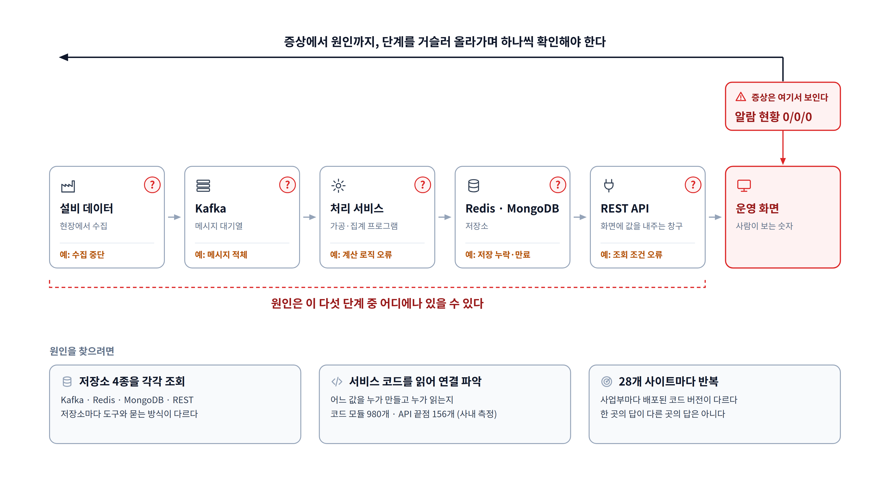

# ① 증상과 원인의 거리

**이 그림이 답하는 질문**: "숫자 하나 이상한 게 왜 찾기 어려운가?"

## 발표 메모

1. **오른쪽 끝, 운영 화면에서 증상이 보인다.** 예를 들어 생산 중인 라인의 알람 현황이 0/0/0이다.
2. **그런데 원인은 그 앞 다섯 단계 중 어디에나 있을 수 있다.** 수집이 멈췄을 수도, 메시지가
   쌓였을 수도, 계산이 틀렸을 수도, 저장이 빠졌을 수도, 조회 조건이 틀렸을 수도 있다.
3. **그래서 화면에서 거슬러 올라가며 단계마다 확인해야 한다.** 그 확인이 어려운 이유가 아래
   세 가지다 — 저장소마다 묻는 방법이 다르고, 코드를 읽어야 연결이 보이고, 그걸 28개
   사이트마다 해야 한다.

## 그림 요소와 근거

| 요소 | 근거 |
|---|---|
| 파이프라인 6단계 | 대상 시스템 구조 — 설비 → Kafka → 서비스 → Redis/MongoDB → REST API ([README](../../README.md), [step-00](../../ops-agent/STEPS/step-00-overview.md)) |
| 증상 "알람 현황 0/0/0" | 순찰이 실제로 점검하는 항목의 유형 ([step-04](../../ops-agent/STEPS/step-04-probes.md), [step-05](../../ops-agent/STEPS/step-05-rules.md)) |
| 코드 모듈 980개 · API 끝점 156개 | 사내 코드로 잰 숫자 — 모듈은 [step-11d](../../ops-agent/STEPS/step-11d-index.md) "사내 첫 code check", 끝점은 [step-11c](../../ops-agent/STEPS/step-11c-flow.md) "사내 끝점 숫자" |
| 28개 사이트, 사업부마다 배포 버전이 다름 | [handover](../../ops-agent/STEPS/handover.md) "대상 환경의 규모", [decisions ⑧](../../ops-agent/STEPS/decisions.md) |

단계별 "예:"는 원인의 **종류**를 보이기 위한 일반 예시다.
