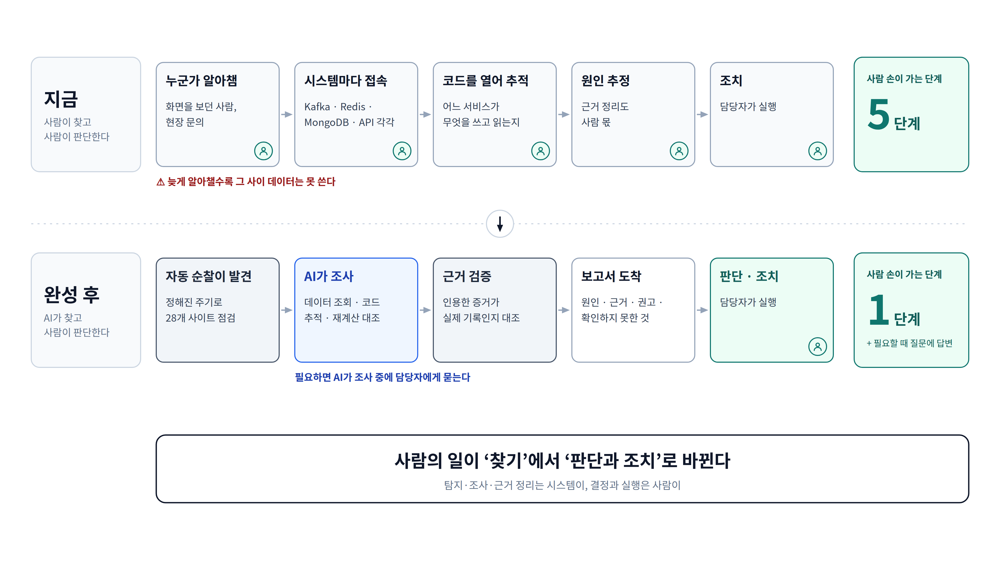

# ② Before / After 대응 흐름

**이 그림이 답하는 질문**: "이게 생기면 일하는 방식이 무엇이 달라지나?"

## 발표 메모

1. **지금은 다섯 단계 전부 사람이 한다.** 누군가 알아채야 시작되고, 시스템마다 들어가 보고,
   코드를 열어 연결을 따라가고, 원인을 추정해 정리하고, 조치한다.
2. **늦게 알아챌수록 손해다.** 파이프라인이 끊긴 동안의 데이터는 나중에 쓸 수 없다.
3. **완성 후에는 사람 손이 가는 단계가 하나다.** 발견·조사·근거 검증은 시스템이 하고, 담당자는
   근거가 붙은 보고서를 받아 판단하고 조치한다. 조사 중 사람 확인이 필요하면 AI가 묻는다.
4. **핵심: 사람의 일이 "찾기"에서 "판단과 조치"로 바뀐다.**

## 짚을 점

- **단계 수로 비교했다, 시간으로 하지 않았다.** 사내에서 사건 하나에 실제로 걸리는 시간을
  재지 않았기 때문이다. 실측치가 생기면 각 줄 끝에 시간을 덧붙이는 것이 가장 강하다.
- "늦게 알아챌수록 그 사이 데이터는 못 쓴다"는 순찰 주기를 정할 때 운영이 인지한 위험이다
  ([decisions ⑭](../../ops-agent/STEPS/decisions.md)).
- 완성 후 줄의 단계는 [③ 아키텍처](03-architecture.md)와 같은 부품이다.
