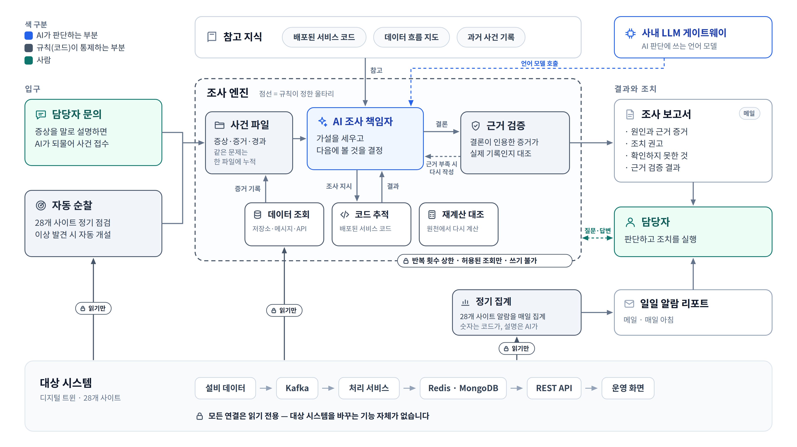

# ③ 전체 아키텍처 (개념도)

**이 그림이 답하는 질문**: "이게 뭘 하는 시스템이고, 우리 시스템에 무슨 영향을 주나?"

## 발표 메모 (읽는 순서)

1. **왼쪽 — 문제가 들어오는 입구가 둘이다.** 담당자가 증상을 말로 문의하거나, 시스템이
   28개 사이트를 스스로 순찰하다 이상을 발견한다. 어느 쪽이든 같은 사건 파일로 모인다.
2. **가운데 — 조사 엔진.** AI 조사 책임자가 가설을 세우고, 세 가지 도구(데이터 조회 · 코드
   추적 · 재계산 대조)로 증거를 모으는 일을 반복한다. 점선 테두리는 규칙이 정한 울타리다 —
   몇 번까지 반복할지, 무엇을 조회할 수 있는지는 AI가 아니라 규칙이 정한다.
3. **결론은 근거 검증을 거친다.** 결론이 인용한 증거가 실제로 수집된 기록인지 규칙으로
   대조하고, 근거가 부족하면 다시 쓰게 한다.
4. **오른쪽 — 보고서는 담당자에게, 조치는 사람이.** 조사 중에 사람의 확인이 필요하면 중간에
   묻고 답을 받아 이어 간다.
5. **아래 — 대상 시스템과의 연결은 전부 읽기 전용이다.** 바꾸는 기능 자체가 없다.
6. **별도로 매일 아침 알람 리포트가 나간다.** 숫자는 코드가 세고, AI는 설명만 붙인다.

## 그림 요소와 근거

| 요소 | 무엇 | 근거 |
|---|---|---|
| 입구 둘, 엔진 하나 | 사람이 연 사건과 순찰이 연 사건은 출처 표시만 다르고 같은 엔진을 탄다 — 원인 판정 로직이 두 벌이면 둘은 갈라진다 | [step-00](../../ops-agent/STEPS/step-00-overview.md) |
| 같은 문제는 한 파일에 누적 | 이상이 계속되면 새 사건을 열지 않고 기존 사건에 첨부한다 | [step-06a](../../ops-agent/STEPS/step-06a-gate.md) |
| 규칙 울타리 | 반복 횟수 상한·동시 실행 폭·허용된 조회 목록은 코드가 쥐고, 그 안에서 무엇을 볼지만 AI가 정한다 | [step-10a](../../ops-agent/STEPS/step-10a-graph.md), [step-10b](../../ops-agent/STEPS/step-10b-lead.md) |
| 조사 도구 3종 | AI가 자유롭게 도는 하위 에이전트가 아니라, 규칙이 정한 조회 목록에서 고르는 "닫힌 도구"다 — 재현·감사가 된다 | [decisions ⑰](../../ops-agent/STEPS/decisions.md) |
| 코드 추적 | 배포된 버전의 서비스 코드에서 "이 값을 누가 만들고 어디서 읽는가"를 함수 단위로 짚는다 | [step-11b](../../ops-agent/STEPS/step-11b-trace.md), [step-11d](../../ops-agent/STEPS/step-11d-index.md) |
| 근거 검증 | AI가 인용한 증거 번호를 믿지 않고 실제 기록과 대조한다 | [step-10b](../../ops-agent/STEPS/step-10b-lead.md) "증거 인용 검사", 로드맵 12a |
| 질문·답변 | 조사 중 사람에게 묻고 답을 받아 이어 간다 | 로드맵 13 |
| 읽기만 | 어댑터에 쓰기 메서드를 만들지 않아 "쓰라"는 요청 자체가 표현되지 않는다 | [step-00](../../ops-agent/STEPS/step-00-overview.md) "이 시스템이 절대 안 하는 것" |
| 정기 집계 | 숫자는 코드가 세고 AI는 코드가 준 숫자만 인용한다(없는 숫자를 쓰면 거부) | [step-09b](../../ops-agent/STEPS/step-09b-aggregate.md), [step-09e](../../ops-agent/STEPS/step-09e-comment.md) |

## 예상 질문

- **"AI가 잘못 판단하면?"** — 결론마다 근거 증거가 붙고, 근거가 실제 기록인지 규칙이
  대조한다. 확인하지 못한 것은 보고서에 "확인하지 못한 것"으로 따로 적는다. 조치 실행은 항상
  사람이다.
- **"우리 시스템에 부하나 변경을 주나?"** — 연결은 전부 읽기 전용이다. 조회마다 시간 제한과
  건수 상한이 있고, 조사 한 건의 반복 횟수(기본 6라운드)와 한 번에 도는 조회 수(기본 3)에도
  상한이 있다.
- **"데이터가 밖으로 나가나?"** — AI 판단에는 사내 LLM 게이트웨이를 쓴다.
