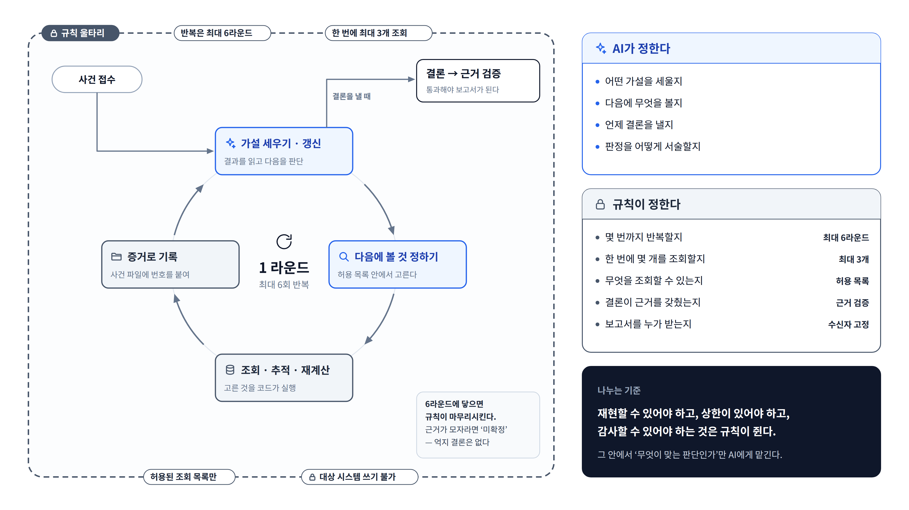

# ④ AI가 일하는 방식 — 울타리 안의 순환

**이 그림이 답하는 질문**: "AI가 멋대로 움직이지 않나? 어디까지 AI에게 맡기나?"

## 발표 메모

1. **조사는 한 바퀴씩 돈다.** AI가 가설을 세우고, 다음에 볼 것을 고르고, 고른 조회를 코드가
   실행하고, 결과가 증거 번호를 달고 기록되면, AI가 그걸 읽고 가설을 고친다. 이게 한 라운드다.
2. **바퀴 바깥의 점선이 규칙 울타리다.** 최대 몇 바퀴(6라운드), 한 번에 몇 개(3개), 무엇을
   조회할 수 있는지(허용 목록), 대상 시스템에 쓰기 불가 — 전부 규칙이 정하고 AI는 바꿀 수 없다.
3. **끝맺음도 규칙이 지킨다.** 6라운드에 닿으면 규칙이 마무리시키고, 근거가 모자라면 억지로
   결론을 만들지 않고 "미확정"으로 끝낸다. 결론은 근거 검증을 통과해야 보고서가 된다.
4. **오른쪽 표가 요약이다.** 무엇이 맞는 판단인가는 AI가, 재현·상한·감사가 필요한 것은
   규칙이 쥔다.

## 그림 요소와 근거

| 요소 | 근거 |
|---|---|
| 라운드 구조(가설 → 고르기 → 실행 → 기록 → 갱신) | [step-00](../../ops-agent/STEPS/step-00-overview.md) "조사 엔진의 모양", [step-10a](../../ops-agent/STEPS/step-10a-graph.md) |
| 최대 6라운드 · 한 번에 3개 | `investigation.max_rounds` 기본 6, `parallel_width` 기본 3 (`ops-agent/src/config/schema_app.py`) |
| 허용 목록 안에서 고른다 / 코드가 실행 | AI는 등재표의 조회(action)만 고르고 실행은 코드가 한다 ([decisions ⑰](../../ops-agent/STEPS/decisions.md)) |
| 증거로 기록 | AI가 말한 증거 번호가 아니라 실제로 실행된 조회만 증거가 된다 ([step-10b](../../ops-agent/STEPS/step-10b-lead.md) "증거 인용 검사") |
| "미확정" 허용, 억지 결론 금지 | 원 설계 스펙 §2.4 integrate ([spec](../superpowers/specs/2026-09-02-ops-monitoring-design.md)) |
| 수신자 고정 | 메일 수신자는 config가 정하고 본문이 바꿀 수 없다 ([step-08](../../ops-agent/STEPS/step-08-mail.md)) |
| 나누는 기준 | [CLAUDE.md](../../CLAUDE.md) 규율 6 |
