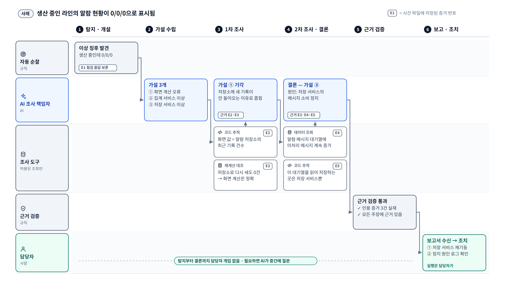

# ⑤ 사건 처리 스토리보드

**이 그림이 답하는 질문**: "AI가 실제로 한 사건을 어떻게 푸는가? 사람은 어디서 무엇을 하나?"

가로는 시간 순서(단계), 세로는 누가 하는가(레인)다. 파란 칸만 AI가 판단한 것이고, 나머지는
규칙과 기록이다.

## 발표 메모 (단계별)

1. **탐지·개설** — 정기 순찰이 "생산 중인데 알람 현황이 0/0/0"인 라인을 찾는다. 그때 받은
   응답을 첫 증거(E1)로 보존하고 사건을 연다.
2. **가설 수립** — AI가 가능한 원인을 셋 세운다: 화면 계산 오류, 집계 서비스 이상, 저장
   서비스 이상.
3. **1차 조사** — 코드 추적으로 "화면 값은 알람 저장소의 최근 기록 건수"라는 것을 확인하고(E2),
   저장소를 직접 다시 세어도 0건이라 화면 계산은 정확하다는 것을 확인한다(E3). AI는 화면
   쪽 가설을 버리고 "저장소에 새 기록이 안 들어오는 이유"로 좁힌다.
4. **2차 조사·결론** — 알람 메시지 대기열에 처리 안 된 메시지가 계속 쌓이고 있고(E4), 그
   대기열을 읽어 저장하는 곳은 저장 서비스뿐이다(E5). AI는 "저장 서비스의 메시지 소비 정지"로
   결론을 낸다.
5. **근거 검증** — 결론이 인용한 증거가 실제 기록인지, 근거 없는 주장이 없는지를 규칙이
   대조한다. 여기를 통과해야 보고서가 된다.
6. **보고·조치** — 담당자가 근거가 붙은 보고서를 받고 조치한다(재기동, 정지 원인 확인).
   그 전까지 담당자는 아무것도 하지 않았다.

## 짚을 점

- **"없다"를 확인하는 방식** — 3단계의 재계산 대조가 "화면이 틀렸다"와 "데이터가 없다"를
  가른다. 숫자가 0일 때 사람이 가장 오래 헤매는 지점이다.
- **증거 번호(E1~E5)** — 보고서의 모든 주장은 이 번호로 출처를 단다. 담당자는 번호를 따라
  "언제, 어디서, 무엇을 물어서 무엇을 받았는지"를 그대로 볼 수 있다.
- **사람의 자리** — 조사 중 확인이 필요하면 AI가 중간에 묻는다. 묻지 않아도 되는 사건은
  보고서가 올 때까지 사람 손이 가지 않는다.

## 예시에 대해

- **증상**("생산 중인데 알람 현황 0/0/0")은 순찰이 실제로 점검하는 항목의 유형이다
  ([step-04](../../ops-agent/STEPS/step-04-probes.md), [step-05](../../ops-agent/STEPS/step-05-rules.md)).
- **원인 경로**(저장 서비스 소비 정지)는 로컬 측정판에 심어 조사시켜 본 고장과 같은 모양이다
  ([step-11c 측정](../../ops-agent/STEPS/step-11c-flow.md), [step-11b 측정](../../ops-agent/STEPS/step-11b-trace.md)).
  서비스·저장소 이름은 일반화했다.
- 판정·근거 검증·보고(5·6단계)는 로드맵 12a·12b가 완성된 모습을 전제로 그렸다.
- 사내 첫 실제 사례가 판정까지 가서 정답과 맞으면, 사내 사본에서는 이 그림을 그 사례로
  바꾸는 것이 가장 강하다.
