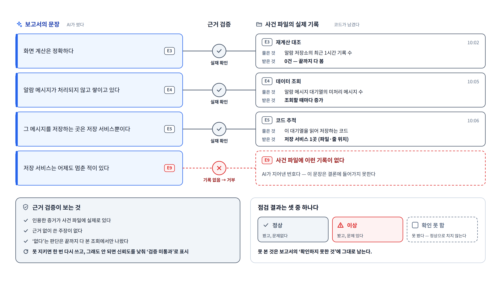

# ⑥ 근거 검증 구조

**이 그림이 답하는 질문**: "AI가 그럴듯하게 지어내면 어떻게 아나?"

## 발표 메모

1. **왼쪽은 AI가 쓴 보고서 문장이다.** 문장마다 끝에 증거 번호가 붙는다.
2. **오른쪽은 조사 중에 코드가 남긴 실제 기록이다.** 언제, 무엇을 물었고, 무엇을 받았는지가
   그대로 있다. AI가 쓴 게 아니다.
3. **가운데에서 규칙이 둘을 대조한다.** 번호가 실제 기록과 이어지면 통과(✓). 마지막 줄처럼
   AI가 없는 번호(E9)를 대면 그 문장은 결론에 들어가지 못한다(✗).
4. **"없다"도 검사한다.** "기록이 0건"이라는 증거는 끝까지 다 본 조회에서 나왔을 때만 근거로
   인정한다. 일부만 보고 "없다"고 하면 안 된다.
5. **못 본 것은 못 봤다고 적는다.** 점검 결과는 정상 · 이상 · 확인 못 함 셋이고, 확인 못 한 것을
   정상으로 치지 않는다. 보고서에 따로 남는다.

## 그림 요소와 근거

| 요소 | 근거 |
|---|---|
| AI가 말한 증거 번호를 믿지 않고 실제 기록만 남긴다 | [CLAUDE.md](../../CLAUDE.md) 규율 3, [step-10b](../../ops-agent/STEPS/step-10b-lead.md) "증거 인용 검사" |
| 결론 단계의 근거 검증, 실패 시 재작성 1회 → 신뢰도 강등 + "검증 미통과" 표시 | 원 설계 스펙 §2.4 verify ([spec](../superpowers/specs/2026-09-02-ops-monitoring-design.md)), 로드맵 12a |
| "없다"는 끝까지 본 조회에서만 | 잘린 조회는 잘렸다고 기록된다(예: Mongo는 상한+1건을 읽어 잘림을 안다, `ops-agent/src/infrastructure/mongo_reader.py`) |
| 정상 · 이상 · 확인 못 함 | [decisions ⑪](../../ops-agent/STEPS/decisions.md), README "순찰" |

증거 내용과 시각은 ⑤ 스토리보드의 사례에 맞춘 예시다.
