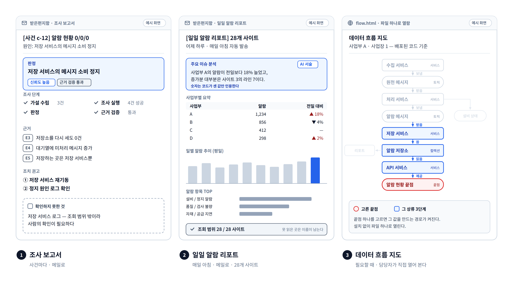

# ⑦ 담당자가 받는 결과물

**이 그림이 답하는 질문**: "그래서 사람 손에 실제로 무엇이 들어오나?"

## 발표 메모

1. **조사 보고서** — 사건마다 메일로 온다. 맨 위에 판정 한 줄과 신뢰도, 그 아래 조사 단계가
   어디까지 갔는지, 판단마다 붙은 증거 번호, 조치 권고, 그리고 **확인하지 못한 것**이 따로 있다.
   마지막 칸이 이 보고서를 믿을 수 있게 하는 칸이다 — 안 본 것을 본 척하지 않는다.
2. **일일 알람 리포트** — 매일 아침 28개 사이트 전체를 집계해 메일로 온다. 숫자·표·추이는
   코드가 세고, 위의 "주요 이슈 분석" 문장만 AI가 쓴다. AI는 코드가 센 숫자만 인용할 수 있다.
   맨 아래 조회 범위가 몇 곳을 실제로 읽었는지 말한다.
3. **데이터 흐름 지도** — 담당자가 필요할 때 연다. 화면의 값 하나를 고르면 그 값을 만드는
   서비스·메시지·저장소 경로가 켜진다. 설치 없이 파일 하나로 열린다.

## 그림 요소와 근거

| 요소 | 근거 |
|---|---|
| 보고서 구성(판정·단계 체크리스트·근거·권고·확인 못 한 것) | 원 설계 스펙 §5.1, v2 방향 §4.1 ([spec](../superpowers/specs/2026-09-02-ops-monitoring-design.md), [v2](../superpowers/specs/2026-09-04-v2-service-direction.md)), 로드맵 12b |
| 로그는 조회 범위 밖 → 사람 확인 | 로그 읽기는 아직 없다(원 스펙 부록 A.1 "스코프 밖 명시, 사람 요망") |
| 일일 리포트 섹션(주요 이슈 분석·사업부별 요약·일별 추이·항목 TOP·조회 범위) | `ops-agent/src/report/blocks.py`, [step-09c](../../ops-agent/STEPS/step-09c-render.md) |
| AI는 코드가 센 숫자만 인용 | [step-09e](../../ops-agent/STEPS/step-09e-comment.md) |
| 흐름 지도(끝점을 고르면 상류 3단계) | `flow.html` — [step-11c](../../ops-agent/STEPS/step-11c-flow.md), README "대상 코드" |

**세 화면 모두 예시다.** 숫자·이름은 지어낸 것이다. 일일 리포트는 이미 사내에서 매일 나가고
있으므로, 사내 사본에서는 실제 메일 캡처(이름 가림)로 바꾸면 가장 설득력이 있다.
