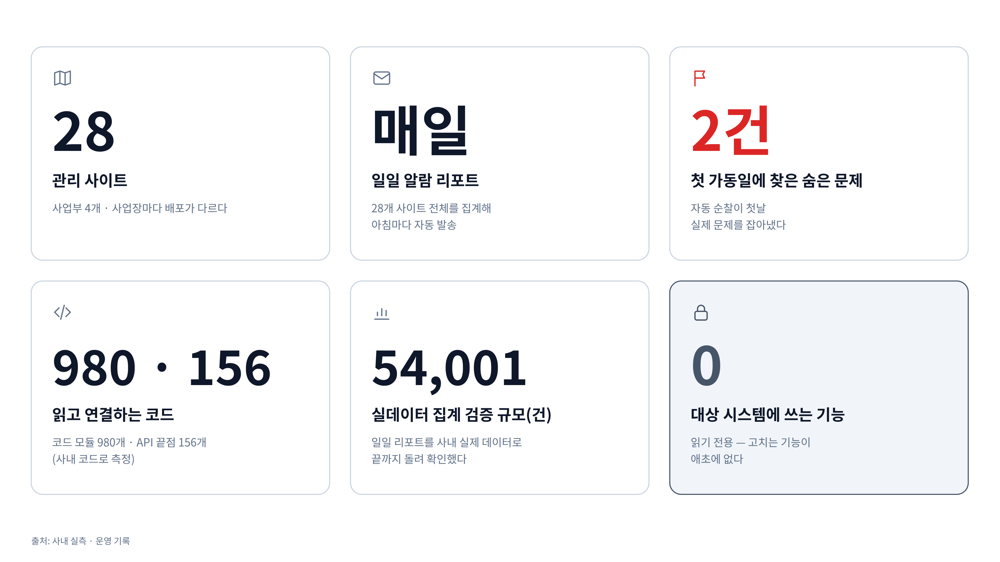

# ⑧ 운영 규모 숫자 카드

**이 그림이 답하는 질문**: "얼마나 큰 일이고, 실제로 돌아가 본 건가?"

## 발표 메모

- **28개 사이트**를 사람이 매번 다 들여다볼 수는 없다. 사업부 4개에 사업장마다 배포가 다르다.
- **일일 알람 리포트는 매일** 28개 사이트 전체를 집계해 아침마다 나간다.
- **자동 순찰은 첫 가동일에 실제 문제 2건**을 잡았다.
- 조사는 대상 코드를 직접 읽는다 — **코드 모듈 980개, API 끝점 156개** 규모다.
- 일일 리포트는 **54,001건 규모의 실제 데이터**로 끝까지 돌려 확인했다.
- **대상 시스템에 쓰는 기능은 0** — 읽기 전용이 정책이 아니라 구조다.

## 숫자의 출처

| 숫자 | 출처 |
|---|---|
| 28개 사이트 · 사업부 4개 | [handover](../../ops-agent/STEPS/handover.md) "대상 환경의 규모" |
| 매일 28개 사이트 전체 | 같은 문서 — "일일 리포트는 28개 전부를 돌고 있다(사내 확인 완료)" |
| 첫 가동일 2건 | [step-00](../../ops-agent/STEPS/step-00-overview.md) "번호 순이 아니라 의존성 순으로", [handover](../../ops-agent/STEPS/handover.md) |
| 모듈 980개 | [step-11d](../../ops-agent/STEPS/step-11d-index.md) "사내 첫 code check" |
| API 끝점 156개 | [step-11c](../../ops-agent/STEPS/step-11c-flow.md) "사내 끝점 숫자" |
| 54,001건 | [handover](../../ops-agent/STEPS/handover.md) "사내에서 확인된 것" |
| 쓰는 기능 0 | [step-00](../../ops-agent/STEPS/step-00-overview.md) "이 시스템이 절대 안 하는 것", [CLAUDE.md](../../CLAUDE.md) 규율 9 |

완성 뒤의 숫자(조사 건수, 원인 적중률 등)는 로드맵 15단계의 측정이 끝나면 이 카드에 더한다.
지금 칸을 비워 두는 이유는 측정 전 숫자를 적으면 그 숫자가 보고의 신뢰를 깎기 때문이다.
