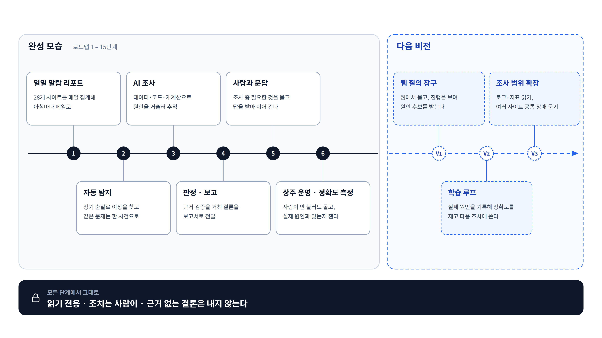

# ⑨ 로드맵 — 완성 → 다음 비전

**이 그림이 답하는 질문**: "어디까지가 이번 완성이고, 그다음은 무엇인가?"

## 발표 메모

1. **완성 모습은 여섯 덩어리다.** 일일 알람 리포트 → 자동 탐지 → AI 조사 → 판정·보고 →
   사람과 문답 → 상주 운영과 정확도 측정. 마지막 칸이 "실제 원인과 맞는지 잰다"인 것이
   중요하다 — 완성은 "돌아간다"가 아니라 "얼마나 맞히는지 숫자가 있다"에서 끝난다.
2. **다음 비전은 셋이다.**
   - **웹 질의 창구** — 메일·명령어 대신 웹에서 묻고, 조사 진행을 지켜보고, 원인 후보 여러 개를
     근거와 함께 받는다(⑩).
   - **학습 루프** — 담당자가 실제 원인을 기록하면 정확도를 재고, 과거 사건이 다음 조사의
     출발점이 된다(⑪).
   - **조사 범위 확장** — 로그·지표까지 읽고, 여러 사이트에 같은 장애가 났을 때 한 건으로 묶는다.
3. **바뀌지 않는 것.** 어느 단계에서도 읽기 전용, 조치는 사람, 근거 없는 결론은 내지 않는다.

## 덩어리와 로드맵 단계의 대응

| 덩어리 | ops-agent 단계 |
|---|---|
| 일일 알람 리포트 | 8 · 9a–9g |
| 자동 탐지 | 4 · 5 · 6a · 6b |
| AI 조사 | 10a · 10b · 11a–11d |
| 판정 · 보고 | 12a · 12b |
| 사람과 문답 | 13 |
| 상주 운영 · 정확도 측정 | 14 · 15 |

1–3(뼈대·도메인·설정·어댑터)과 7(사내 LLM 연결)은 모든 덩어리의 바닥이라 따로 그리지 않았다.
단계 번호의 단일 진실 소스는 [step-00 로드맵 표](../../ops-agent/STEPS/step-00-overview.md)다.

## 비전의 출처

| 비전 | 출처 |
|---|---|
| 웹 질의 창구 | [v2 방향](../superpowers/specs/2026-09-04-v2-service-direction.md) §1 타깃 (3), §4.4 웹 서비스 표면 |
| 학습 루프 | 같은 문서 §4.5 학습 루프의 산출물 |
| 로그·지표 읽기 | 원 설계 스펙 §4.1 확장점(`LogReader`·`MetricsReader` 이름 예약) |
| 공통 장애 묶기 | [decisions ⑫](../../ops-agent/STEPS/decisions.md) — 지금은 묶지 않고 "실제 빈도를 잰 뒤 정한다" |
