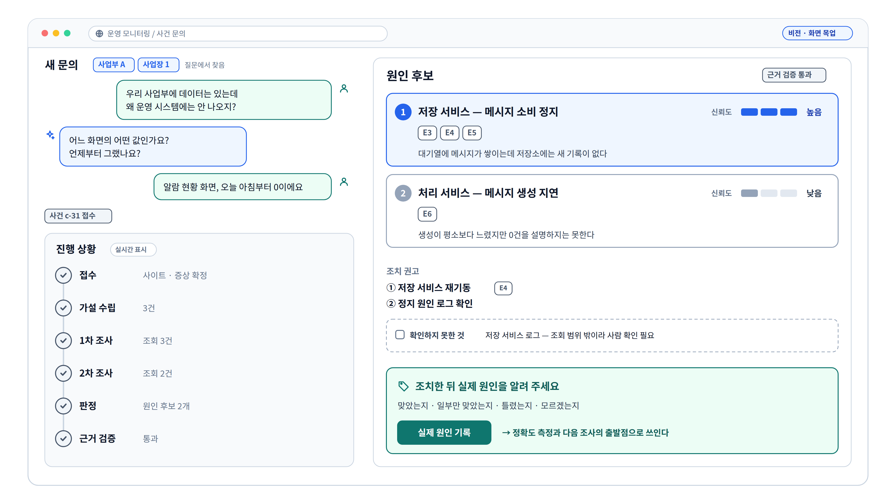

# ⑩ 비전: 웹 질의 창구 화면 목업

**이 그림이 답하는 질문**: "다음 단계에서는 사람이 어떻게 쓰게 되나?"

## 발표 메모

1. **질문을 말로 한다.** "우리 사업부에 데이터는 있는데 왜 운영 시스템에는 안 나오지?" —
   사업부·사업장은 질문에서 찾고, 모자란 것은 AI가 되묻는다.
2. **진행을 지켜본다.** 접수부터 근거 검증까지 지금 어디인지가 실시간으로 보인다. 창을 닫았다
   다시 열어도 이어서 보인다.
3. **원인 후보를 여러 개 받는다.** 후보마다 신뢰도와 근거 증거 번호가 붙는다. 하나로 단정하기
   어려울 때 그 사실 자체를 보여 준다.
4. **조치 뒤 실제 원인을 한 번 눌러 기록한다.** 맞았는지·일부만 맞았는지·틀렸는지·모르겠는지.
   이 기록이 ⑪ 학습 루프의 재료다.

## 짚을 점

- **화면은 조사를 직접 하지 않는다.** 문의를 접수하고 결과를 보여 줄 뿐이고, 조사는 뒤의 조사
  엔진이 한다. 그래서 화면을 닫거나 서버를 재시작해도 조사가 사라지지 않는다.
- **누가 무엇을 물을 수 있는지 접수 단계에서 한 번 거른다.** 읽기 전용이어도 사업장의 데이터와
  코드를 읽는 조사를 시작시키는 일이라서다.

## 출처

| 요소 | 출처 |
|---|---|
| 질문 예시 | [v2 방향](../superpowers/specs/2026-09-04-v2-service-direction.md) §1 타깃 (3) — 사람 파트너가 제시한 질문 |
| 사이트 해석·되묻기, 제출→조회, 진행 이벤트 | 같은 문서 §3.6, §4.4 |
| 원인 후보 여러 개 + 신뢰도 + 근거 | 같은 문서 §4.1 "다중 후보", §4.4 RCA 응답 |
| 실제 원인 기록(맞음/일부/틀림/모름) | 같은 문서 §4.5 `RootCauseLabel.agreement` |
| 화면은 조사하지 않는다 | 같은 문서 §3.1, [CLAUDE.md](../../CLAUDE.md) 규율 9 |
| 접수 단계의 권한 확인 | 같은 문서 §3.5 |

화면 구성과 문구는 예시다. 원 템플릿(`src/api/`)에 HTTP 표면이 있고, ops-agent 로드맵에는 아직
들어 있지 않은 비전이다.
