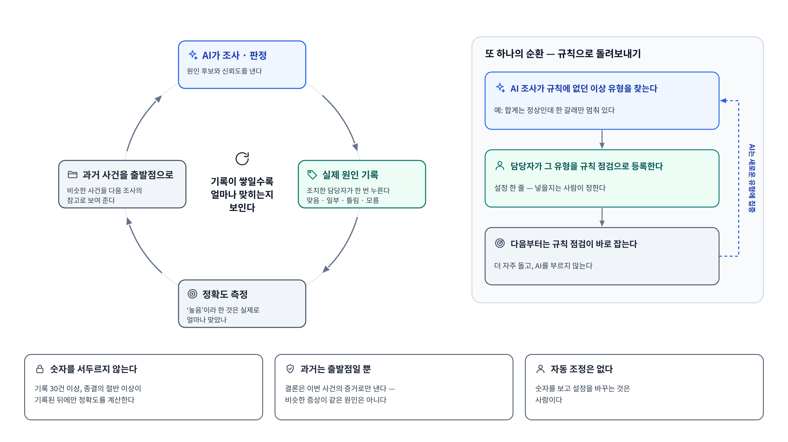

# ⑪ 비전: 학습 선순환

**이 그림이 답하는 질문**: "쓰면 쓸수록 무엇이 좋아지나? 그걸 어떻게 아나?"

## 발표 메모

1. **왼쪽 순환 — 맞혔는지를 잰다.** AI가 원인 후보와 신뢰도를 내고, 조치한 담당자가 실제
   원인을 한 번 기록한다. 그게 쌓이면 "AI가 ‘높음’이라고 한 것이 실제로 얼마나 맞았나"를 잴 수
   있다. 그리고 지난 사건들은 다음 비슷한 사건의 출발점으로 보여 준다.
2. **오른쪽 순환 — 잡은 것은 규칙으로 돌려보낸다.** AI 조사가 규칙에 없던 이상 유형을 찾으면
   담당자가 그것을 규칙 점검으로 등록한다. 다음부터는 규칙이 더 자주, AI 없이 잡고, AI는 새로운
   유형에 집중한다.
3. **지키는 선 셋.** 표본이 적을 때 퍼센트를 내지 않는다. 과거 사건은 출발점일 뿐 결론의
   근거가 아니다. 숫자를 보고 설정을 바꾸는 것은 사람이다.

## 짚을 점

- "쓸수록 정확해진다"가 아니라 **"쓸수록 얼마나 맞히는지 보인다"**로 썼다. 앞의 문장은 측정
  전에는 약속할 수 없다. 뒤의 문장은 이 순환이 보장하는 것이다.
- 기록 한 번은 맞음·일부·틀림·모름 네 가지 중 고르는 것이다 — 자유 서술을 자동으로 비교하면
  "plan-sync"와 "plan sync 서비스"처럼 같은 것을 다르게 쓴 것도 틀린 것으로 센다.

## 출처

| 요소 | 출처 |
|---|---|
| 실제 원인 기록(4분류) · 신뢰도별 정확도 | [v2 방향](../superpowers/specs/2026-09-04-v2-service-direction.md) §4.5 |
| 30건 · 절반 이상 기록 전에는 계산하지 않음 | 같은 문서 §4.5, 리포 [README](../../README.md) |
| 과거 사건을 출발점으로(결론 근거는 아님) | 같은 문서 §4.5 "과거 장애 → 초기 가설", 원 설계 스펙 §3.2 우선순위 사다리 |
| 규칙으로 돌려보내기 | 원 설계 스펙 부록 A.2 마지막 문단 ([spec](../superpowers/specs/2026-09-02-ops-monitoring-design.md)) |
| 자동 조정 없음 | v2 방향 §6 "메트릭 기반 자동 조정" 기각 |

원 템플릿에는 기록·정확도 계산이 이미 있고(`case label`), ops-agent 로드맵에는 아직 들어 있지
않은 비전이다.
