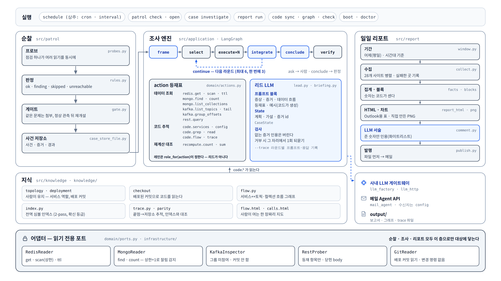

# 부록 — 기술 아키텍처 상세

**이 그림의 용도**: 질의응답에서 "실제로 어떻게 짜여 있나?"가 나왔을 때 펼치는 한 장. 본문의
[③ 개념도](03-architecture.md)와 같은 구조를 모듈 이름까지 내려 그렸다.

## 읽는 법

- **위 줄 — 실행 진입점.** 전부 `python -m src <명령>`이다. 상주 프로세스는 `schedule` 하나다.
- **가운데 세 덩어리 — 순찰 · 조사 엔진 · 일일 리포트.** 색은 본문과 같다: 파랑이 LLM이 판단하는
  자리(frame · integrate · conclude, 리드 LLM, 리포트의 LLM 서술), 회색이 코드가 쥐는 자리다.
- **조사 엔진의 action 등재표**가 리드가 고를 수 있는 읽기의 전부다. 레인(데이터 조회 · 코드 추적 ·
  재계산 대조)은 `role_for(action)`이 정한다.
- **지식 층**은 `code.*` action이 읽는다. 배포된 커밋으로 읽고, 흐름 그래프·심볼 인덱스·추적기를 둔다.
- **맨 아래 어댑터 층이 대상 시스템에 닿는 유일한 길이다.** 포트에 쓰기 메서드가 없다.

## 완성 전제 — 아직 코드에 없는 자리

이 보고는 로드맵이 끝난 모습을 전제로 하므로 그림에 다 그렸다. 발표자가 알고 있어야 할 현재 위치:

| 그림의 자리 | 로드맵 | 지금 |
|---|---|---|
| `conclude` · `verify` 노드 | 12a | 그래프는 `frame → select → execute → integrate`까지(`src/application/graph.py`) |
| 조사 보고서 발행 | 12b | 조사 결과는 CLI 출력과 `--trace` 파일로만 나온다 |
| ask → 사람 | 13 | — |
| 순찰을 스스로 돌리는 데몬 · 조사 워커 | 6b · 14 | `schedule`은 일일 리포트를 돌린다. 순찰·조사는 명령으로 돈다 |

진행 상태의 단일 진실 소스는 [ops-agent README의 진행 표](../../ops-agent/README.md)다.

## 모듈과 근거

| 자리 | 파일 |
|---|---|
| 프로브 · 판정 · 게이트 | `ops-agent/src/patrol/{probes,rules,gate}.py` |
| 그래프 · 노드 · 리드 | `ops-agent/src/application/{graph,nodes,lead,briefing}.py` |
| action 등재표 · 레인 | `ops-agent/src/domain/actions.py` |
| 지식 층 | `ops-agent/src/knowledge/{checkout,flow,index,trace,parity}.py` |
| 일일 리포트 | `ops-agent/src/report/{window,collect,facts,blocks,comment,publish}.py`, `src/presentation/report_html.py` |
| 어댑터 | `ops-agent/src/infrastructure/{redis_reader,mongo_reader,kafka_inspector,rest_prober,git_reader}.py` |
| Kafka 그룹 미참여 | `kafka_inspector.py` 모듈 docstring — `assign()`, `group_id=None` |
| Mongo 잘림 감지 | `mongo_reader.py` "limit+1을 읽는 이유" |
